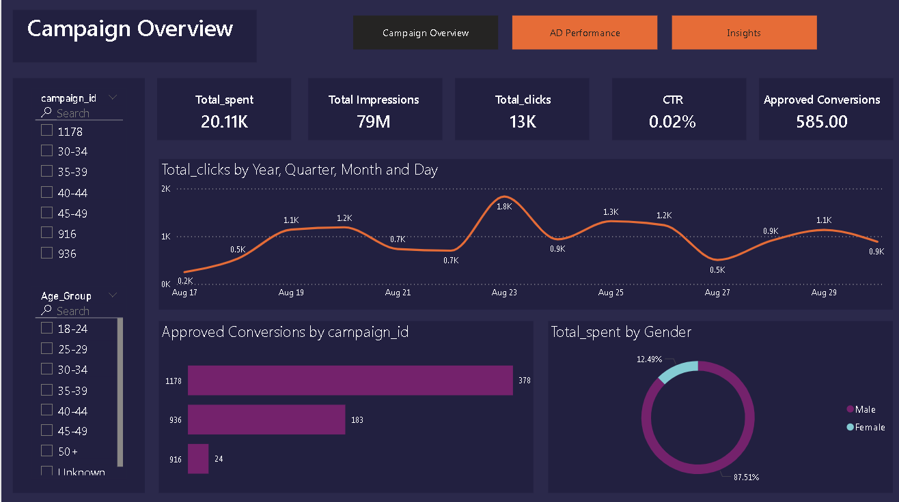
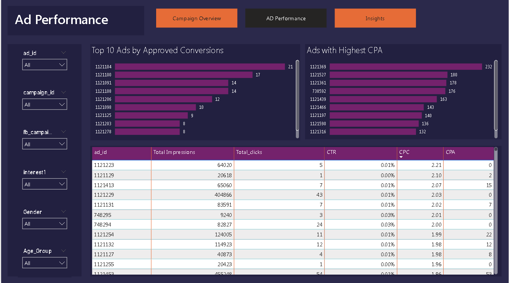
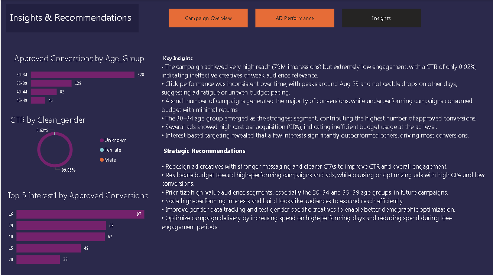

## Ad Campaign Performance Analytics Dashboard

##  Project Summary 

This project demonstrates my ability to analyze real-world digital advertising data and translate it into clear business insights and strategic recommendations.
Using simulated Facebook/Instagram Ads data, I evaluated campaign effectiveness, identified performance gaps, and built an interactive Power BI dashboard to support data-driven marketing decisions.

## Key focus areas:

Campaign performance evaluation

Audience and demographic analysis

Cost efficiency and ROI optimization

Business-focused storytelling with data

## Business Problem

Marketing teams often invest heavily in ad campaigns without clear visibility into:

Which campaigns actually drive conversions

Where budget is being wasted

Which audience segments perform best

This dashboard answers these questions by converting raw ad data into actionable insights for decision-makers.

## 🛠️ Project Phases

| Phase | Description |
|-------|------------|
| Data Cleaning | Fixed data type errors, handled missing values, standardized age and gender fields |
| Data Modeling | Created clean dimension fields for age groups and gender using DAX |
| KPI Creation | Built CTR, CPA, conversion metrics for performance tracking |
| Analysis | Identified high-performing campaigns, ads, audiences, and interests |
| Visualization | Designed a 3-page interactive Power BI dashboard |
| Recommendations | Provided data-backed optimization strategies |

## Tools & Skills Demonstrated

Power BI – Dashboard design, DAX, slicers, interactivity

Power Query – Data cleaning & transformation

DAX – KPI calculations (CTR, CPA)

Marketing Analytics – Campaign evaluation, audience segmentation

Data Storytelling – Turning insights into business actions

## 📁 Dataset Description

| Column Name | Description |
|------------|------------|
| ad_id | Unique ad identifier |
| campaign_id | Campaign identifier |
| fb_campaign_id | Facebook campaign reference |
| reporting_start | Campaign start date |
| reporting_end | Campaign end date |
| age | Audience age group |
| gender | Audience gender |
| interest1 | Primary interest category |
| impressions | Number of times ads were shown |
| clicks | Number of clicks |
| spent | Total ad spend |
| total_conversion | Total conversions |
| approved_conversion | Approved conversions |

## Dashboard Structure

## Page 1: Campaign Overview

High-level KPIs (Spend, Impressions, Clicks, CTR, Conversions)

Campaign-level performance summary

Demographic overview

## Page 2: Ad Performance Analysis

Ad-level CTR, CPA, and conversions

Campaign-wise and interest-based breakdown

Identification of top and underperforming ads

## Page 3: Insights & Recommendations

Key analytical findings

Strategic, data-driven recommendations

Optimization roadmap

## Key Findings

| Area | Finding |
|------|---------|
| Overall Campaign Performance | Total ad spend reached **20.11K**, generating **79M impressions** but only **13K clicks**, resulting in a very low **CTR of 0.02%**, indicating weak engagement. |
| Engagement Quality | Despite high reach, engagement remained poor, suggesting **ineffective creatives** or **misaligned audience targeting**. |
| Click Trends Over Time | Clicks peaked around **Aug 23 (~1.8K clicks)**, with noticeable drops on **Aug 21** and **Aug 27**, indicating **inconsistent performance** and possible **ad fatigue**. |
| Campaign Contribution | A small number of campaigns drove most conversions: **Campaign 1178 (~378)** and **Campaign 936 (~183)**, while **Campaign 916 (~24)** significantly underperformed. |
| Audience Age Performance | The **30–34 age group** was the strongest segment, delivering **328 approved conversions**, followed by **35–39 (129)**, making them the **primary target audience**. |
| Gender Spend vs Engagement | **87.51% of spend** was allocated to males, yet **99.05% of CTR** came from **“Unknown” gender**, highlighting **poor gender data quality** and tracking limitations. |
| Ad-Level Efficiency | Several ads showed **high CPA (up to 232)** while delivering low conversions, indicating **inefficient budget utilization** at the ad level. |
| Interest-Based Targeting | A small group of interests (**Interest 16, 29, and 10**) generated the majority of conversions, presenting strong opportunities for **focused audience scaling**. |

## Strategic Impact & Recommendations

Improve CTR through stronger creatives and A/B testing

Reallocate budget toward high-performing campaigns and ads

Focus targeting on high-conversion age groups (30–39)

Scale top-performing interests and optimize audience segments

Improve data quality for better demographic analysis

